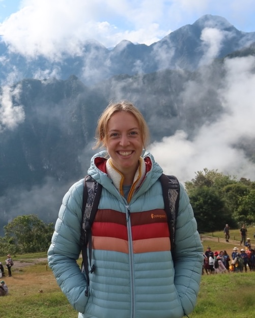

---
hide:
  - navigation
  - toc
---

# Principal Investigator

<a href="https://faculty.washington.edu/jonno/" target="_blank">Jon Wakefield </a> – Professor of Statistics and Biostatistics at University of Washington

{width='300' }

# Our Team

- <a href="https://alanamcgovern.github.io" target="_blank">Alana McGovern</a> – PhD Student in Statistics at University of Washington
    <figure markdown="span">
    {width='200' }
    </figure>
    

        small area estimation, Bayesian modeling, spatial modeling
    

- </a> Andrea Boskovic – PhD Student in Statistics at University of Washington
    <figure markdown="span">
    {width='220' }
    </figure>
    

        Survey methodology, uncertainty quantification, Bayesian statistics
    

- <a href="https://victoriaknutson.github.io" target="_blank">Victoria Knutson </a> – PhD Student in Biostatistics at University of Washington
    <figure markdown="span">
    {width='270' }
    </figure>
    

        Bayesian inference, demography, global health, mortality modeling
    

