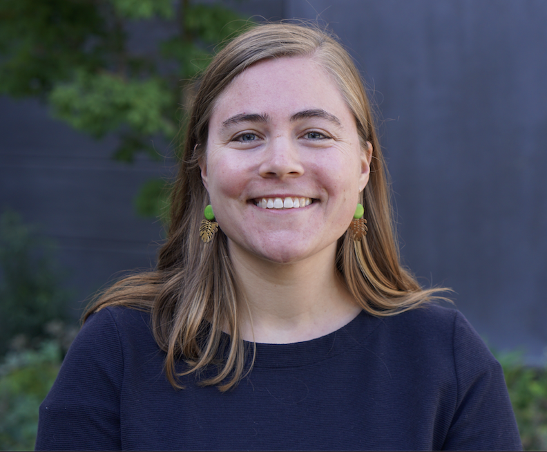

---
hide:
  - navigation
  - toc
---

# Principal Investigator

<a href="https://faculty.washington.edu/jonno/" target="_blank">Jon Wakefield </a> – Professor of Statistics and Biostatistics at University of Washington

{width='300' }

# Our Team

- <a href="https://www.ntnu.edu/employees/geir-arne.fuglstad" target="_blank">Geir-Arne Fuglstad </a> – Professor of Statistics, Department of Mathematical Sciences, Norwegian University of Science and Technology
    <figure markdown="span">
    {width='200' }
    </figure>
    

        Spatial and spatio-temporal statistics, SPDE models, non-stationary modelling, computational statistics, and spatio-temporal estimation of demographic and health indicators
    

- <a href="https://victoriaknutson.github.io" target="_blank">Victoria Knutson </a> – PhD Student in Biostatistics at University of Washington
    <figure markdown="span">
    {width='300' }
    </figure>
    

        Bayesian inference, demography, global health, mortality modeling
    

- <a href="https://alanamcgovern.github.io" target="_blank">Alana McGovern</a> – PhD Student in Statistics at University of Washington
    <figure markdown="span">
    {width='210' }
    </figure>
    

        small area estimation, Bayesian inference, spatial modeling, public health
    

-  Katie Paulson – PhD Student in Biostatistics at University of Washington
    <figure markdown="span">
    {width='320' }
    </figure>
    

        Statistical demography, survival analysis, spatial epidemiology
    

- <a href="https://ameerd.github.io/" target="_blank">Ameer Dharamshi </a> – PhD Student in Biotatistics at University of Washington
    <figure markdown="span">
    {width='220' }
    </figure>
    

        Correlated data, small sample size problems, spatiotemporal modelling, demography
    

- <a href="https://scholar.google.com/citations?user=EnqxccIAAAAJ&hl" target="_blank">Awan Afiaz </a> – PhD Student in Biostatistics at University of Washington
    <figure markdown="span">
    {width='200' }
    </figure>
    

       longitudinal and correlated data Analysis, survival analysis, global/public Health
    

- <a>Zihang Yu </a> – Masters Student in Biostatistics at University of Washington
    <figure markdown="span">
    {width='250' }
    </figure>
    

       streamlined pipeline for analysis of MICS surveys
    

